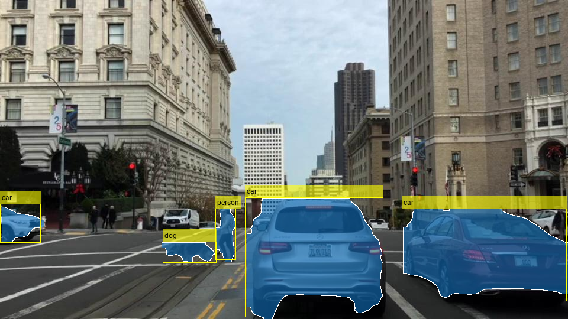

# Pretrained YOLO v11 LiteRT Model For Segmentation and Object Detection with MATLAB

This repository provides pretrained YOLO v11[1] LiteRT models for real-time segmentation and object detection. The models were exported to LiteRT (formerly known as TFLite) format following the guidelines in https://docs.ultralytics.com/integrations/tflite/.

## Models

| File | Precision | Size | Description |
|------|-----------|------|-------------|
| `yolo11s-seg_float32.tflite` | Float32 | 38.8 MB | Full-precision baseline model |
| `yolo11s_seg_float16.tflite` | Float16 | 19.5 MB | Half-precision weights, float32 I/O |
| `yolo11s-seg_int8_dynamic_quant.tflite` | Int8 (dynamic) | 10.1 MB | Weights quantized to int8 for storage; dequantized to float32 at runtime. No calibration needed. |
| `yolo11s-seg_integer_quant.tflite` | Int8 (integer) | 10.2 MB | Weights and activations quantized to int8 internally; float32 I/O. Requires calibration data during export. |

## License
The software and model weights are released under the [GNU Affero General Public License v3.0](https://github.com/ultralytics/ultralytics?tab=AGPL-3.0-1-ov-file#readme). For alternative licensing, contact [Ultralytics Licensing](https://www.ultralytics.com/license).

## Example Result

## Getting Started
To perform segmentation and object detection using the pretrained YOLO v11 LiteRT models in MATLAB, follow the example [Generate Code for Segmentation and Object Detection Using YOLO v11 LiteRT Model](https://www.mathworks.com/help/coder/ug/generate-CUDA-code-for-YOLO-v11-segmentation-and-object-detection-LiteRT-model.html). The example shows how to simulate the YOLO v11 model in MATLAB as well as generate code for the model to deploy on edge devices.

## Network Overview
YOLO v11 is one of the best performing object detectors and is considered as an improvement to the existing YOLO variants such as YOLO v8, YOLO v9 and YOLO v10.

Following are the key features of the YOLO v11 object detector compared to its predecessors:
- Improved Accuracy with Fewer Parameters: YOLO v11 is expected to offer enhanced accuracy while using fewer parameters compared to previous versions, such as, YOLO v8. This improvement can lead to more precise and reliable detection results.
- Better Speed and Efficiency: YOLO v11 may have optimizations that allow it to achieve faster processing speeds while maintaining high accuracy. This can be crucial for real-time applications or scenarios with limited computational resources.
- Enhanced Object Classification: YOLO v11 employs an improved backbone and neck architecture that enhances feature extraction capabilities for improvements in object classification capabilities, allowing for more accurate and detailed classification of detected objects.

## References
[1] https://github.com/ultralytics/ultralytics

Copyright 2025-2026 The MathWorks, Inc.
